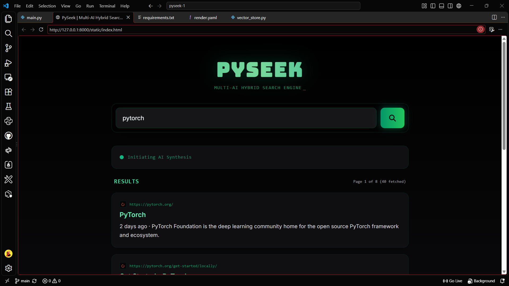

# PySeek

PySeek is a lightweight, local-first hybrid search engine and AI-powered synthesis interface built with FastAPI and modern web technologies. It aggregates live web results, community discussion hubs (Reddit, X), and provides intelligent AI research summaries using OpenRouter.

---

## Preview

> Add a screenshot or GIF of your running application here to showcase your user interface.



---

## Features

- **Live Web Scraping and Search:** Integrates real-time querying using DuckDuckGo search adapters with built-in community fallback items.
- **AI Synthesis:** Leverages OpenRouter API integration (supporting models like DeepSeek) to generate comprehensive Markdown-formatted research summaries.
- **Community Context Injection:** Automatically pins relevant discussion hubs from Reddit and X alongside standard web results.
- **Local-First Design:** Fully functional on your local machine to avoid cloud provider IP blocking, rate limits, and network latency.
- **Modern Responsive UI:** Features a sleek frontend housed in the static directory with clean results cards and instant switching.

---

## Tech Stack

- **Backend:** Python, FastAPI, Uvicorn, Httpx, Beautiful Soup 4
- **Search Engine Integration:** `duckduckgo_search`
- **AI Integration:** OpenRouter API (`deepseek/deepseek-chat`)
- **Frontend:** HTML5, CSS3, JavaScript (Static files)

---

## Project Structure

```text
pyseek/
│
├── static/             # Frontend files (HTML, CSS, JS UI)
├── assets/             # Documentation images and media
├── .env                # Environment variables (API keys)
├── .gitignore          # Git exclusion rules
├── main.py             # FastAPI backend server and endpoints
├── requirements.txt    # Python package dependencies
└── README.md           # Project documentation
```

Getting Started Locally
Follow these steps to set up and run PySeek on your local machine:

1. Clone the Repository
Bash
git clone [https://github.com/your-username/pyseek.git](https://github.com/abinasz/pyseek.git)
cd pyseek
2. Create and Activate a Virtual Environment
Bash
python -m venv venv
# On Windows:
venv\Scripts\activate
# On macOS/Linux:
source venv/bin/activate
3. Install Dependencies
Bash
pip install -r requirements.txt
4. Configure Environment Variables
Create a .env file in the root directory of your project and add your OpenRouter API key:

Code snippet
OPENROUTER_API_KEY=your_actual_openrouter_api_key_here
5. Run the Application
Start the FastAPI server using Uvicorn:

Bash
uvicorn main:app --reload
6. Open in Your Browser
Navigate to your local server address:
http://127.0.0.1:8000 or http://localhost:8000


AI Synthesis API: GET /api/ai-synthesis?q=<query>

Connects to OpenRouter to generate a structured, Markdown-formatted research briefing based on the search topic.


